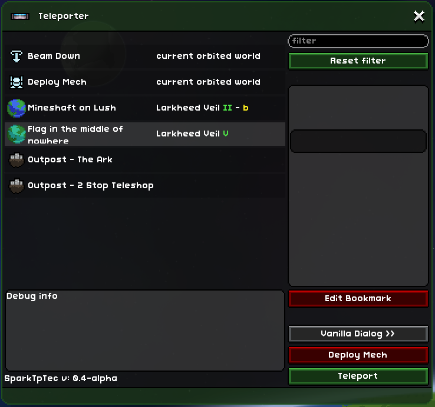

# sb.Teleport

Spark Industries used some minor sorcery to reimagine Teleportation UI.

Works almost entirely on vanilla Lua callbacks (and occasionally hazelnut chocolate), but can get additional minor bonuses from OpenSb or StarExtensions callbacks.

Planned features will probably be available in Issues. Soon :tm: Suggestions are welcome but no promises.

## Flavor

Everything is achieveable through technology. Better living, robust health and - for the first time in our history - the possibility of a better teleportation. Hello and welcome to Spark Indistries. What you'll need for spacefaring is right here.

Project sb.Teleport, courtesy of SI, was created as a response to the tender published by the Terrene Protectorate. Its goal was to create a convenient, functional and simple UI system paired with their newly implemented Ship-based Artificial Intelligence Latice. Eventually another finalist had been chosen, one the Terrene Protectorate dubbed more... "agreeable".

We at SI, however, never lost hope. While the Protectorate's eventual demise was tragic and untimely, not in the least due to billing and development plans put on indefinite hold, it also offered an opportunity to get access to Ship Lattices circumventing usual Protectorate bureaucracy. We finally got a chance to see our ideas in practice. Please, keep in mind that new technology involves risks, so remember to backup your important data before upgrading, and report any issues with the system to our engineers. A happy customer is a healthy customer with their limbs still attached. Be safe and travel with a flash!

Thank you for choosing Spark Industries.

## Installation

Download as a folder and drop to `StarboundLocation/mods`. If you don't need access to source,`/src` folder can be safely removed.

Currently in alpha phase. Especially editing bookmarks. Backup your character before installing!

## Usage

Replaces teleport window of vanilla ship teleports. Old interface is still accessible via fallback button.

Features:

- All the usual QoL MetaGUI stuff
- You can deploy mech anywhere you can teleport
- Filtering! Filter can be set via corresponding textbox. `Enter` while in the textbox applies the filter (only bookmarks that have `filter` in their text fields are visible). Search is case-insensitive. Standard destinations (like `Warp down`) are not affected. `Esc` while in the textbox or `Reset` button resets the filter
- Previewing hazards. If a bookmark is selected, info panel tries to list permanent environmental hazards at destionation. Don't forget to equip your EPP!
- Now with editing and deletion. Editing supports longer names than stock UI (but be careful). Deletion asks for confirmation. Polite.
- Supports longer names (Vanilla bookmark names are limited to 28 characters)

The script tries its best to skip all irrelevant destinations, if present in `teleport.config`. Examples:

- When on the player ship, `Warp to ship` is disabled
- When in space, warp option without the mech is disabled (you can still try to warp regardless, but you agree to indemnify and hold Spark Industries harmless of paying any possible medical bills)
- Quest-related destinations are disabled until unlocked
- If a player has no mech (yet), `Deploy` button will be deactivated.

## Known Issues

- Tooltips on hazard icons in planet info don't show
- Celestial Database client cache in vanilla Sb is unstable. Symptom: when a bookmark is selected, planetary info shows `Celestial Database Error`. A workaround is to click other bookmarks until the cache refreshes. *Fixed in OpenSb*.

- Possibly cannot warp down if a player is **not** on their own ship (example: on another shup also orbiting a planet). **Needs verification**
- Cannot warp to party members via this dialog. Seems to be a limitation of vanilla Lua callbacks.
- Cannot warp in mission dungeon to party members already present in the dungeon. Likewise.

## Development

Source code is written in Typescript. Since Starbound doesn't deal with Typescript, it's converted into Lua with [TSTL](https://typescripttolua.github.io/) (Typescript-To-Lua transpiler). Don't forget to `npm install` to pull all standard TS dependencies. The command you'll eventually need is `npm run build`.

`prebuild` step is triggered automatically before each `build` to copy any files in `/src` which are _not_ Typescript files into output folder (mod root). This will overwrite the files present there without asking, so be careful.

`/src/@types` folder and any `*.d.ts` files are not transpiled but ignored instead.

Source Typescript files (`*.ts`) are transpiled into `*.lua-raw`. The reason of this is that while I attempted to use TSTL-compatible syntax everywhere, some TS functions have no direct or easily identifiable counterpart in Lua, and traspiler replaces them with non-working stubs (that typically have `_TS_` in names). These need to be rewritten into Lua manually before the files can be run. After this is done, feel free to rename `*.lua-raw` files to simple `*.lua`.

## License

TBA

## Requirements

Uses MetaGUI for quick window UI. Thus, requires either [Stardust Core](https://github.com/zetaPRIME/sb.StardustSuite) or Stardust Core Lite (former Quickbar Mini) to work (MetaGUI is included in both).

## Useful links

[Stardust MetaGUI help](https://github.com/zetaPRIME/sb.StardustSuite/tree/master/StardustLib/sys/metagui)

[Typescript to Lua transpiler](https://typescripttolua.github.io/docs/getting-started)

## Credits and Kudos

Previously used v6's [Handheld Teleporter](https://steamcommunity.com/workshop/filedetails/?id=751199367) as a quick hack during prototyping phase. Current version does *not* include this mod and should not conflict with it.

Thanks to [zetaPRIME](https://github.com/zetaPRIME) for help with Stardust MetaGUI

Thanks to Zygan for some friendly Lua advice

Thanks to patmanf for more advice

Thanks to OpenSb Discord users for support.